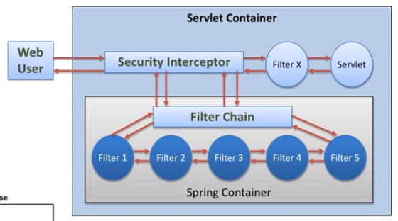
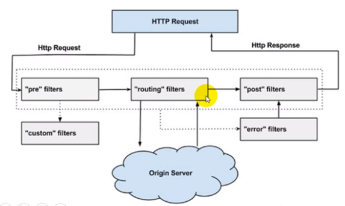
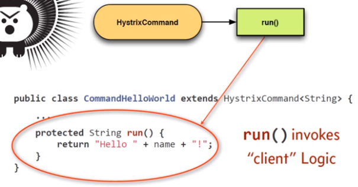
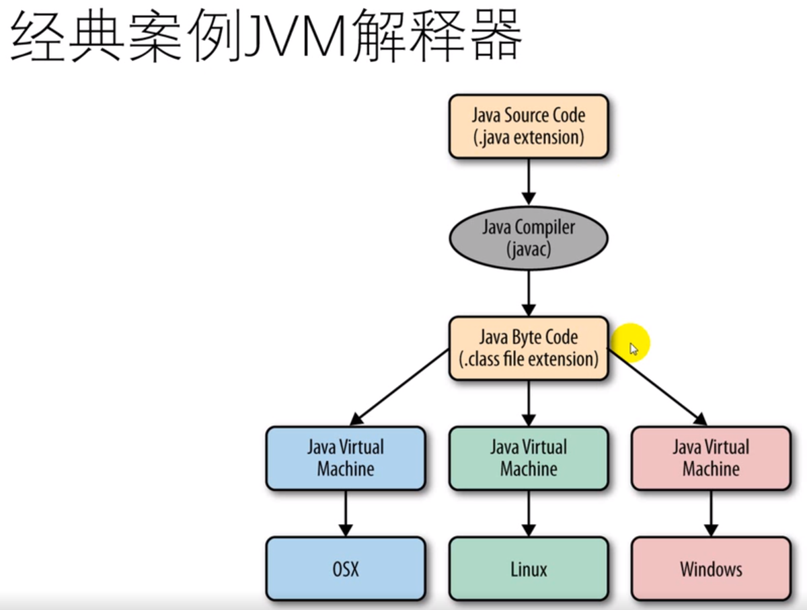
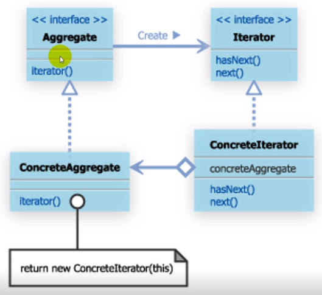

### 工厂模式

工厂设计模式的思考：

#### 简单工厂和工厂方法差异？

- 工厂方法只会返回一种类型的实例，最好具有父类或者共同实现的接口。
- 简单工厂：用来生产同一等级结构的任意产品（对于任意新增的产品，无能为力）
- 工厂方法：用来生产同一等级结构中的固定产品（支持增加任意产品）
- 抽象工厂：用来生产不同产品族的全部产品。（对于新增的产品，无能为力，只是多种实现定义好的产品生成，实例的组合，支持添加产品族，就是产品的下线由谁生产，但是生产什么是事先固定好的）

#### 工厂方法和抽象工厂差异？

- 抽象工厂关键在于产品之间的抽象关系，所以至少要两个产品，工厂方法在于生成产品，不关注产品键的关系，所以可以只生成一个产品。
- 抽象工厂中客户端把产品的抽象关系理清楚，在最终使用的时候，一般使用客户端和（其接口），产品之间的关系是被封装固定的；而工厂方法是在最终使用的时候，使用产品本身。
- 抽象工厂更像一个复杂版本的策略模式，策略模式通过更换策略来改变处理方式或者结果，而抽象工厂的客户端，通过更改工厂来改变结果，所以在使用的时候，就使用客户端和更换工厂，而看不到产品本身。
- 工厂方法的目的是生产商品，所以能看到商品，而且还是要使用商品，当然如果产品在创建者内部使用，那么工厂方法就是为了完善创建者，从而可以使用创建者，另外创建者本身是不能更换所生成的产品的。
- 抽象工厂的工厂是类，工厂方法的工厂是方法。

#### 客户和工厂之间还是有耦合，如何进一步优化？

- 依赖反转原理（dependency inversion principle）
- 控制反转（inversion of control）
- 依赖注入（dependency injection）

### 单例模式

- 单例模式限制类的实例化，保证JVM中的类的实例只有一个
- 单例类提供一个可以全局访问单例的入口
- 常用于
  - 日志logging
  - 配置设置类
  - 驱动程序对象
  - 缓存对象
  - 线程池对象
- 其中会涉及JAVA面试题
  - 提前和延迟（lazy）
  - 静态初始化块
  - 多线程安全
  - 双重检查锁定（double checked locking）
  - JVM、JIT指令优化重排
  - 反射（reflection）
  - 序列化（serialization）
  - 克隆（clone）

单例模式：

- 普通的懒汉模式
- 饿汉模式
- 同步饿汉模式
- 比尔普夫模式
- 枚举模式

破坏单例模式：

- 反射破坏
- 防止，就是构造方法抛异常

单例模式的应用：

- Core Java
  - java.lang.Runtime
  - java.awt.Desktop
- Spring 容器
  - Singleton Scope（per container）

破坏单例模式的方法：

### 经典构建者模式

- 将复杂对象的构造和表示分离，相同的构造流程可以创建不同的表示。

四种角色：

- Director（导演）：规范和指导创建流程（规定这个片子怎么拍）
- Builder（导演要求的演员标准）：创建实际产品的接口（拍电影中，需要演员的基本条件）
  - 会空翻
  - 会打架
- ConcreateBuilder（演员）：负责创建复杂产品的具体类，知道每个部件的构造细节（具体某个演员）
  - 成龙，会空翻，会打架
  - 李连杰也会空翻，会打架
- Product（电影）：组装出来的最后产品
  - 最后呈现到荧幕上的最终效果。

#### 构建者模式和抽象工厂区别

- 抽象工厂相比较于普通的工厂就是，
  - 可以生产一个产品族，一个电器行业，都有开关，电灯泡和电风扇
  - 每一个方法可以生成一个产品
- 构建者模式是规定一个产品的生产过程中的具体细节
  - 最终只会构建出来一个产品
  - 建造者模式是创建负载对象的一种分解方式

### 流畅构建者模式

问题域：

- 传统的构建者模式在实际的场景中应用不多
- 流畅接口Fluent Interface实际场景中常用
  - 方法级联（Method Cascading /Chaining）
  - 事实上的Builder模式
- 不可变（immutability）对象需求
  - 不容易出Bug
  - 多线程安全

#### 构造对象实例的传统方式

- 构造函数（Telesoping Constructor Pattern）
- Setter 方法（JavaBeans Pattern）
- 工厂

#### 显微镜构造函数模式

- 罗列各种参数组合复杂繁琐
- 扩展字段，增加构造函数方法
- 构造函数，参数位置，重载哟

#### JavaBean 模式

- 使用一堆的Setter和Getter方法
- 状态可变，一致性保证
  - 应为使用setter，不能保证最终的值是否一致
  - 潜在一致性问题
- 多线程安全

#### 流畅接口模式

- 所有的字段都是final，事先定义好
- 构造函数是私有的，
- 全部都是getter方法，没有setter方法
- 使用一个BeanBuilder实体，并且实体字段也是final可自定义选择
- 每一个方法设置参数完成以后返回的都是自己BeanBuilder
- 最后定义一个Builder方法，代表产品要出炉了，把自己的BeanBuilder实体传入其中，返回Bean实体
- 之后可以进行一些验证操作，返回Bean

#### 优点

- 参数组合更加灵活
- 参数设置直观表意
- 一个构造函数实例可以构造多个对象表示
- 构造出不可变对象（immutable Object）

#### 应用：

- Core Java
  - java.lang.StringBuilder#append()
  - java.lang.StringBuffer#append()
  - java.nio.ByteBuffer#put()
- Spring Framework
  - EmbeddedDataBuilder
  - AuthenticationManagerBuilder
  - UriComponentsBuilder
  - MockMvcWebClientBuilder

Fluent 接口模式有啥不足？适用于什么样的场景?

- Bean 构造方法是私有的，意味着该类不能在客户端代码里直接实例化
- 改立现在有事不可变的了，所有属性嗾使`final`类型的，在构造方法里面被赋值，另外我们只为他们提供了getter方法
- builder类使用了构造方法只接受必须属性，为了确保这些属性在构造方法里赋值，只有这些属性被定义成final类型。

### 适配器模式

#### 定义

- 将类的接口转换成客户期望的接口
- 让具有不兼容接口的类能够相互合作
- 常用名称
  - Wrapper
  - Translator

#### 实例：

- 常见的显示器的接口和笔记本接口 
- 对应到工程中，就是新系统的接口和老系统的接口不能很好的匹配，这就需要中间有一个`Adapter` 将两者连接到一起
- 我自己的理解就是，Service实现和Dao实现，对于底层的实现可以有多种，只是我们平常就只使用一种，致使自己也没有什么感觉。

#### 要素：

- Target：定义客户要使用的接口
- Adapter：中间层的适配
  - 实现Target接口
  - 引入被转换的对象
  - 然后在对应的方法中，调用对应的方法适配呗
- Adaptee：需要被转换的对象
- Client：通过适配器接口Target去使用了Adaptee的功能

#### 注意：

- 适配器模式只是针对两个接口之间的适配，主要是适配功能
- 对于刚开始的Service和Dao的认识有偏差，但是整体的调用流程相似
- 针对接口的适配，接口的适配，接口的适配

利用适配器模式，使用数组实现队列接口

### 桥接模式

问题域：

- 抽象和实现独立变化
- 类层次爆炸（exploding class inheritance）

设计原理：

- 组合优于继承（Prefer composition over inheritance）

- HAS-A 比 IS-A 要好
  - 低耦合
  - 运行期改变行为

主要的思想：

- 由原先的继承关系，一层层的，往下继承的过程中，越往下会导致类内的成员更加复杂，此时我们可以使用桥接模式，对原先的类进行组合配置，使用一个抽象引用，可以更加灵活的实现子类，在桥的两边都可以很灵活的继承父类进行扩展，而且原先的代码结构也不需要改变，使用两层结构，解决类爆炸问题。

桥接器模式：

- 将抽象和实现解耦，让两边都能独立变化
- 适用
  - 跨平台支持
  - 插件plugin
  - 驱动器程序Driver

关系图

关键要素：

将抽象和实现进行解耦，使两边的变化相互不影响

**Abstraction**：定义高层操作，适用Implementor提供的原子操作，提供给客户端适用的抽象，引用Implementor，客户适用该抽象，不需要知道实现者细节。

**RefinedAbstraction**：该类实现Abstraction定义的功能，将实现细节代理到ConcreteImplementor

**Implementor**：实现者接口，一般提供原子primitive操作

**ConCreteImplementor**：具体的实现者

代码抽象发生变化不影响原先的实现。达到abstract 抽象层 和 Implementor 实现层任何一方改变，不会影响到其他结构。

#### 好处：

- 抽象和实现解耦
  - 编译或运行时绑定
- 减少子类数量
- 代码简洁
- 接口和实现可以独立变化
- 易于扩展
- 客户端代码低耦合
  - 依赖于抽象，而非具体实现

#### 应用：

Log日志

#### 桥接模式、适配器模式、策略模式的结构类似，他们之间的差异？

共同点：

- 桥接和适配器都是让两个东西配合工作

不同点：

##### 出发点不同：

- 适配器：改变已有的两个接口，让他们相容
- 桥接模式：分离抽象化和实现，是两者的接口可以不同，目的是分离

如果你拿到两个已有的模块，想让他们同时工作，那么你使用的是适配器模式

如果你什么都还没有，但是想分开实现，那么桥接是一个选择。

桥接是先有桥，才有两端的东西

适配是先有两边的东西，才有适配器

桥接是在桥后之后，两边的东西还是可以变化的。

最容易理解的就是：Java中的JRE环境，它本身就是一个很好的桥，先写好在linux上执行的JRE，再写好可以WIndows下执行的JRE，这样无论什么样的程序，主要配合响应的JRE就可以在Linux和Windows上运行。

两个JRE并没有限定你写什么样的程序，但是有个要求是你必须使用Java来写。

### 组合模式

自我理解：

定义一个接口统一抽象，所有操作，通常使用的场景类似于公司组织架构中的，层级管理，其实本质上是一种递归的方式，但是其中也有针对于比如员工，他同样适用这套规则，但是，它不具备管理能力，此时应该屏蔽掉它的实现，当调用响应的功能的时候，我们应该throw呀。

定义：

- 将对象组织成树形结构，以表示整体部分关系
- 让客户能够统一方式处理单个和组合对象
- 实现利用了递归思想

 应用：

- java.awt.Container#add(Component)
- javax.faces.component.UIComponent#getChildren()

### 装饰器模式（decorate）

问题域：

- 对于不同的类对象的组合，会有各种不同的组合方式，导致子类爆炸问题

设计原理：

- 组合Over继承（composite  Over inheritance）
  - 继承~编译时扩展
  - 组合~运行时扩展
- 开放封闭原理（open close priciple）

定义：

- 为对象动态的添加额外功能
- 在子类继承之外，提供了一种新的扩展功能的方式
- 也称为Wrapper
- 适用场合：（跨横切面）功能（AOP）
  - 安全认证授权
  - 日志
  - 缓存（Caching）
  - 校验
  - 异常处理

组成要素：

- Component：定义待装饰对象的公共接口（类似整体抽象）
- ConcreteComponent：待装饰的实际对象
- Decorator：定义所有可动态添加功能的公共接口，引用Component对象
- ConcreteDecorator：所有可以添加额外功能到ConcreteComponent上的功能类。

理解：

- 因为是在原有的基础上进行封装，所以原来对象的属性公共接口还是要实现的，然后对原先的待装饰的类进行封装，所以会对于待装饰类有一个引用，然后之后具体的装饰类就可以扩展这个装饰器，进行具体的装饰。
- 

应用：

- Java IO library
- sitemesh

#### 优劣：

优点：

- 运行时扩展行为更加灵活
- 任意扩展decorator
- 扩展不影响现有的对象

不足：

- 产生大量类似decorator对象

#### 问题：

- 装饰器模式和适配器模式的差异？

  - 适配器模式，将一个类的接口，转化成客户期望的另一个接口，是撇器让原本接口不兼容的类可以合作无间
  - 装饰器模式：动态将责任附加到对象上，更加灵活，避免了继承中的子类必须无条件继承父类中的所有属性。
    - 装饰者和被装饰者拥有相同的超类型（可能是接口也可以是抽象类）
    - 可以用多个装饰类包装一个对象，装饰类可以包装装饰类或被装饰对象
    - 应为装饰者和被装饰者拥有相同的类型，因此在任何需要原始对象的场合，都可以用装饰过的对象来替代它。
    - 装饰者可以在被装饰者的行为之前或之后，加上自己的附加行为，以达到特殊目的
    - 应为对象可以在任何时候被装饰，所以可以在运行时动态地，不限量地用你喜欢的装饰者来修饰对象。
  - 两者同样是封装但是：适配器模式主要是为了接口的转换，而装饰者模式关注的是通过组合来动态的为被装饰者注入新的功能或行为(即所谓的责任)。 

- 装饰模式和子类继承的差异？

  - 装饰模式比继承要灵活，

    - 避免了继承体系臃肿
    - 降低了类与类之间的关系
    - 装饰器因为增强已有的对象，具备的功能和已有的相同，只不过提供了更强的功能。

### 门面模式Facade

定义：

- 为子系统中的一组接口，提供了一个统一的接口
- 门面提供了一个高层接口，让子系统易于使用

好处：

- 提供了一简化接口，将子系统易于使用
- 客户端不需要创建各个子系统对象，门面会负责
- 门面将客户和子系统解耦，子系统代码不污染客户端

应用：

- 聚合层服务，通过门面将外部的client与内部业务系统的之间的关系

#### 门面模式和适配器模式差异：

- 从表面上看，适配器模式很想门面模式，他们都对别的对象进行包装并改变其呈现的接口
- 二者的差别在于他们如何改变接口
  - 门面元素展现的是一个简化的接口，他并不是提供额外功能的选择，而且甚至为了方便完成常见的任务还会做出一些假定。
  - 适配器模式是把一个接口装换成另一个接口，并不会滤掉某些能力，也不会简化接口
- 自己理解：
  - 门面只是为了更方便
  - 适配器是不得已，老接口已经不能用了。

### 代理模式（Proxy）

#### 定义：

- 提供一个中间代理，以控制对实际对象的访问
  - 封装对目标对象的访问的复杂性
  - 提供额外功能

#### 元素定义：

- Subject：定义RealSubject和Proxy的公共接口，让Proxy在任意需要的地方可以替代RealSubject
- RealSubject：Proxy所代表的的实际对象。
- Proxy：维护对RealSubject的引用，同样实现Subject，控制对RealSubject的访问。

#### 代理种类：

- 远程代理（Remote Proxy）：为不同地址空间中的对象提供一个本地表示，为远程WebServices/REST API提供一个接口
  - RMI 远程调用
  - webService、Rest API
- 虚代理（virtual Proxy）：按需创建耗时资源对象
  - 图片展示缓存
- 保护代理（protection Proxy）：控制对原始对象的访问权限
  - 对于原始对象的访问控制

#### 应用：

- Spring
  - AOP
  - RMI
  - HTTP Invoker
- 微服务网关
  - 安全
  - 路由
  - 审计
  - 协议检测

#### 自我理解：

- 就是在原先的逻辑上自己又多代理了一层，使得在代理的具体操作之前，进行一些操作
- 感觉和适配器模式十分相似，但是适配器模式针对的是接口和接口之间的适配
- 代理模式分为静态代理和动态代理，静态代理是在程序运行之前就已经存在了，到动态代理是程序运行中在内存中生成代理类。
- 代理模式存在的意义：代理模式是为了解决滥用继承的问题而生的，当相对某个类的功能进行扩充的时候可以使用继承或者聚合，很明显使用的时候会造成类的泛滥，
- 动态代理：自己实现很简单，不过JDK提供了方便的解决方案
  - java.lang.InvocationHandler
  - java.lang.reflect.Proxy

#### 代理模式和适配器模式、装饰器模式的差异 

- 适配器VS代理模式

  - 适配器改变所考虑的对象的接口，代理模式不能改变所代理对象的接口

- 装饰器VS代理模式

  - 装饰器为锁装饰的对象提供增强功能，代理模式对对象的使用施加控制，不提供对象本身的增强功能。

- 适配器VS装饰器模式

  - 都是包装模式，适配器把一个API装换成另一个API，装饰器保存被包装对象的API
  - 都是为代理的类扩充新的功能。
  - 关于职责：适配器在转换时增加的职责，装饰器只要给被装饰者新的职责
  - 关于接口：适配器只是调用原先的接口，原接口对新系统是不可见的，装饰器模式原封不动的使用原接口，系统对装饰的对象也可以通过原接口来完成使用
  - 关于包裹的对象：适配器是知道被适配者的详细情况的，装饰器只知道接口是什么，至于具体实现只有在运行期间才知道。

### 职责链模式

#### 定义：

- 通过让多个对象一次处理请求的方式，将请求的接受者和发送者解耦
- 将接受对象组织成链状结构，将请求在链中依次传递，直到某个对象能够处理请求。

#### 设计元素：

- handler：所有能处理请求的类要求实现的公共接口或超类
- ConcreteHandler：能够处理或者向下传递请求的类，实现Handler
- Client：将ConcreteHandler组装成责任链，想责任链发起请求

#### 好处：

- 将发送者和接受者对象解耦
- 使用组合（Composite），对象职责的增删改查更灵活，使用Client组装顺序

#### 应用：

- Spring Security
- 
- 微服务网关过滤器
- 

#### 优化：

抽取公共功能到抽象超类

### 命令模式

#### 定义：

- `行为请求者` 和 `行为实现者` 通常呈现一种紧耦合
- 将一组行为抽象为对象，实现二者之间的松耦合，这就是命令模式

#### 元素：

- Command：用于执行一个行为的接口
- ConcreteConmand：将行为的执行者和行为的调用者进行绑定，该对象负责执行Receiver上的操作
- Client：创建ConcreteCommand对象并设置其Receiver
- Invoker：使用Command对象执行请求
- Receiver：包含实际的行为操作逻辑

#### 优点：

- 调用者和接受者之间通过Command解耦
- 增加Command不需要修改现有的代码，易于扩展

#### 缺点：

- 可能会搞出一堆command

#### 应用：

- java.lang.Runable
- java.swing.Action
- strcts Action
- Netflix hystrix Command

#### 命令模式和责任链模式的区别：

#### 命令模式：

- 一次设定，统一执行。
- 命令模式把一个申请特定操作的请求封装到一个对象中，并给对象一个众所周知的公共接口，使客户端不用了解实际执行的操作就能产生请求，也可以使你改变操作而丝毫不影响客户端程序。
- 使用命令模式的一个主要原因，他们提供了一个便捷的存储方法并能完成undo功能。
- 每个命令都记住刚刚做过的事，并在有undo请求时，之哟啊计算量和内存需求不过分，就能恢复到刚才的状态。

#### 责任链模式：

- 责任链模式转发请求，而命令模式将请求转发给一个特定对象
- 链的组织是从最特殊的到一般的，并且不能保证在任何情况下都会有相应
- 责任链将程序中每个对象能做什么的内容隔离，即职责连减少了对象之间的耦合，每个对象都能独立操作。
- 责任链也可以用于构成主程序的对象和包含其他对象实例的对象。
- 适用场景
  - 具有相同方法的几个对象都适合于程序请求操作，但由对象决定由谁去完成，比把决策建立在调用代码中更合适
  - 其中某个对象可能最好合适处理请求，但你不想通过`if-else`去选择一个特定的对象
  - 程序执行时，需要向处理选项链中添加新的对象

扩展：

- 命令模式：将多个命令提交给一个综合性该命令的对象
- 职责模式：只将一个请求提交给多个能执行该命令的对象

### 解释器模式

#### 定义：

- 给定一个语言和其文法表示，解释器能够翻译该语言中的句子
- 适用于简单文法
- 解释、翻译、转换
- 高级模式

####  应用：

- java.uitl.Pattern
- java.text.Normalizer
- java.text.Format
- spring expression language
- 代码生成器

#### 实现修改代码支持除法

### 迭代器模式

#### 定义：

- 迭代器提供一种遍历集合中元素的方式，不需要暴露元素的底层表示
- 集合和集合遍历逻辑解耦
- 客户端和集合遍历逻辑解耦

#### 应用：

- java 集合框架